% mLogica IIT Presentation Summary
% May 8th, 2020

# mLogica IIT Presentation Agenda

## Presentation Agenda

- Introduction of team members and guests
- Outline of original project and tasks
- Explanation and detail of tasks accomplished
- Summary and future work

## Team

- [mLogica](https://www.mlogica.com/ "mLogica Web site")
  - Neil Okhandiar - System Architect
  - Apurba Saha - DBA & Developer
- IIT/Information Technology and Management - Graduate Students
  - [Balaji Jagannathan](https://www.linkedin.com/in/balaji-jagannathan/ "Balaji Jagannathan Linkedin profile")
  - [Pablo Fernandez Diaz](https://www.linkedin.com/in/pablo-fernandez-diaz/ "Pablo Fernandez Diaz Linkedin Profile")
  - [Rutvik Bhamwari](https://www.linkedin.com/in/rutvik-bhamwari/ "Rutvik Bhamwari Linkedin profile")
  - [Somendra Chaudhary](https://www.linkedin.com/in/somendrac90/ "Somendra Chaudhary Linkedin profile")
  - [Mridul Khullar](https://www.linkedin.com/in/mridul-khullar/ "Mridul Khullar Linkedin profile")
  - [Aniruddh Purohit](https://www.linkedin.com/in/aniruddhp/ "Aniruddh Purohit Linked profile")
  - [Professor Jeremy Hajek](https://www.iit.edu/directory/people/jeremy-hajek "IIT Profile Jeremy Hajek")

## Outline of Project

- Outline from mLogica of the background the initial contact in November of 2019
  - This is purely multi-phase evolutionary Data Analytics project for IIT offered from mLogica Inc.
- Both of the CEO and System Architect Neil Okhandiar, along with other upper management of the company, took great interest in this joint project
  - Giving Apurba a roadmap of what to accomplish with IIT
  - Apurba specified the guidelines and documented the work in each phase to be completed for the students
  - Each student carried out all the work individually in each phase
  - Apurba attended weekly, nearly daily short meetings to check progress, comment on work, and make adjustments to results

## Phases of the Project

- We worked in three phases:
  - Learned how to build queries joining many relations and trying to achieve high granularity of knowledge while working in a simple domain, using AWS S3 and Athena.
  - Building queries over classifications, statistical mean, RMS, co-relations between data & answer some knowledge based questions for senior management, using AWS S3 and QuickSight.
  - Involved various aspects of data analytics like aggregates, text processing, multi-variate running totals (like pivot tables) and also visual presentations, machine learning algorithms, and the IT infrastructure needed to deploy this technology, using AWS S3 and SageMaker
- AWS credentials & accesses for this project were provided by mLogica

## March 2006 - Rutvik

- What happened on March 14th, 2006?
  - Microsoft – Just released Windows Vista
  - iPhone didn’t exist
  - Android didn’t exist
- March 14th, 2006 -  AWS S3 (Simple Storage Service)

## Simple Storage Service

- Object storage over HTTP
  - Cost for storage dropped
  - Immutable object storage
  - Highly available
  - Data accessible via HTTP (can be used through any platform/OS)
  - Decoupled storage and compute

## 


## When S3 grew up

- 2006 - December 2016
- Increasing data creates latency issues
- More time in transfer than doing analyses on that data

## Solution to the problem

- December 2016
  - AWS Athena was born
  - Untraditional way
  - Service that works directly on the data where it sits (in S3)

## Introduction to Athena - Rutvik

- Serverless
- Interactive query platform
- Uses standard SQL for querying data
- Uses Presto (a distributed SQL query engine for Big  Data)
  - AWS Console
  - Athena API
  - Athena CLI
  - JDBC connection

## Continuation

- Only pay for querying for data
- Integrates with ETL tools and  AWS QuickSight for data visualization

## Images from Athena - Rutvik

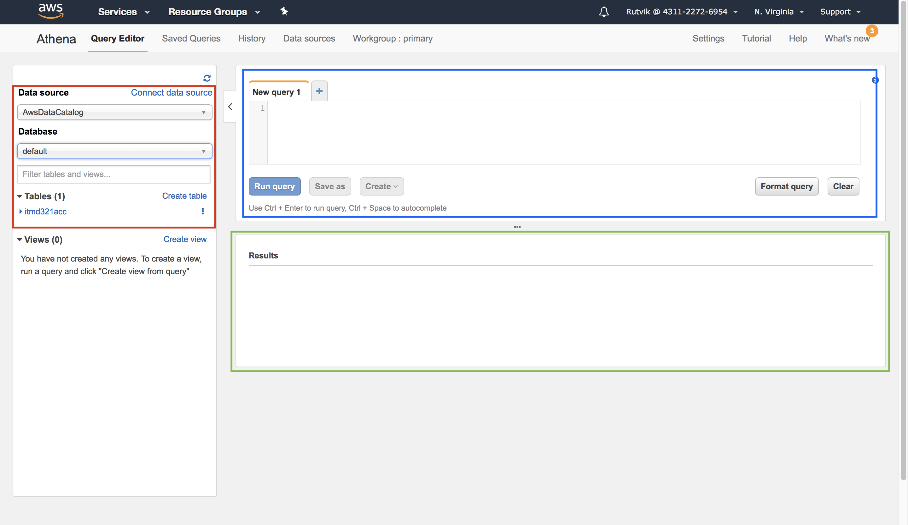

## 

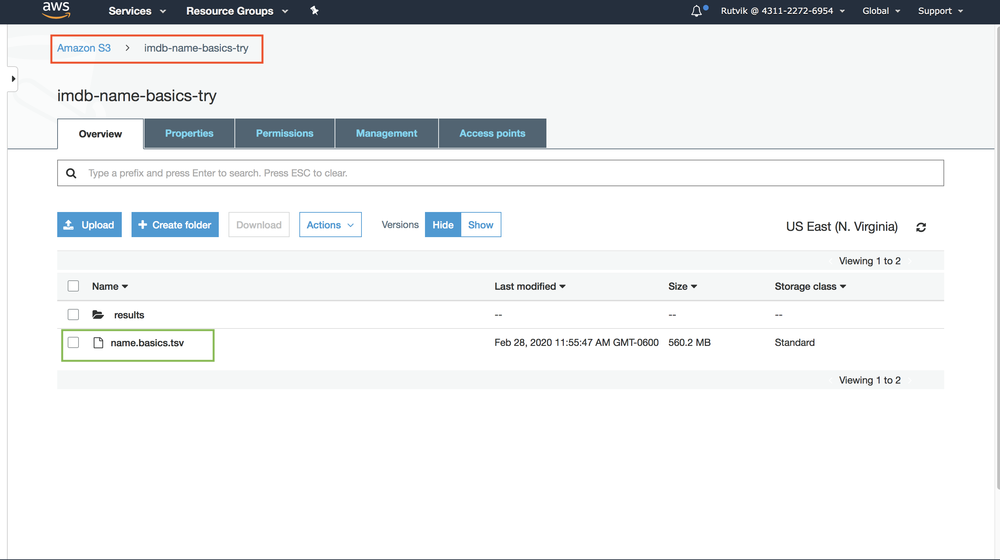

## 


## 

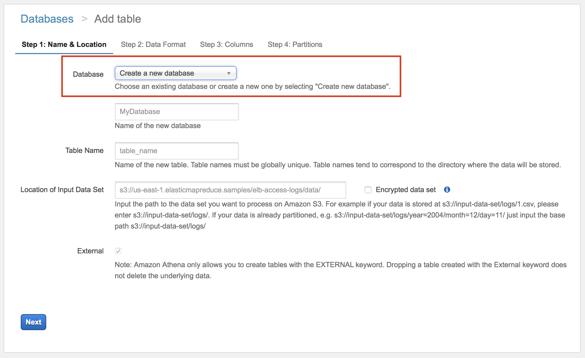

## 

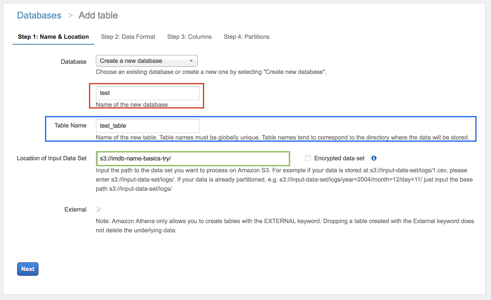

## 


## 

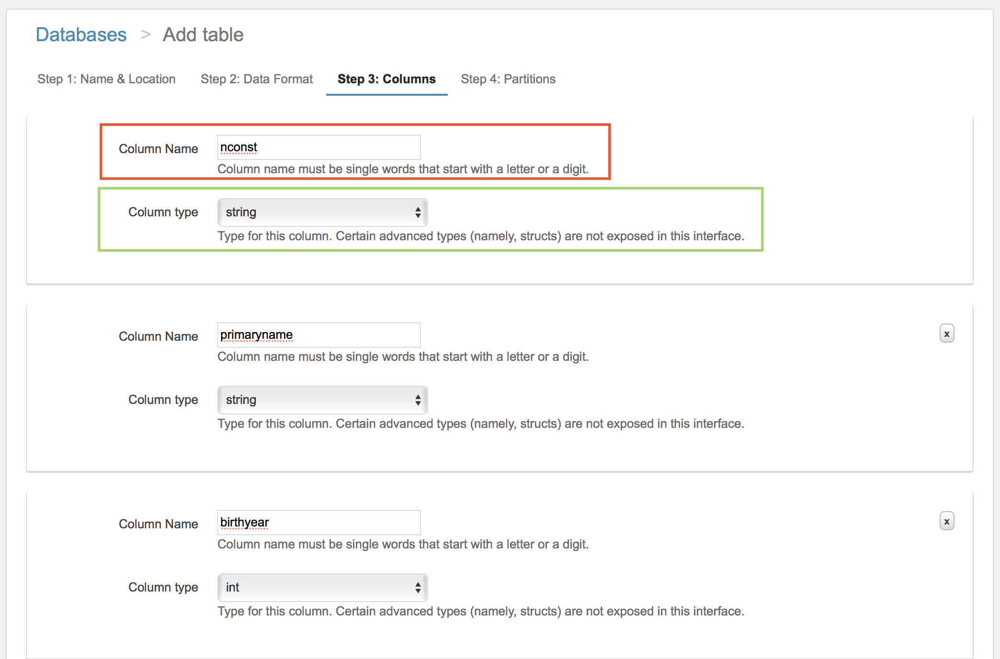

## 


## 

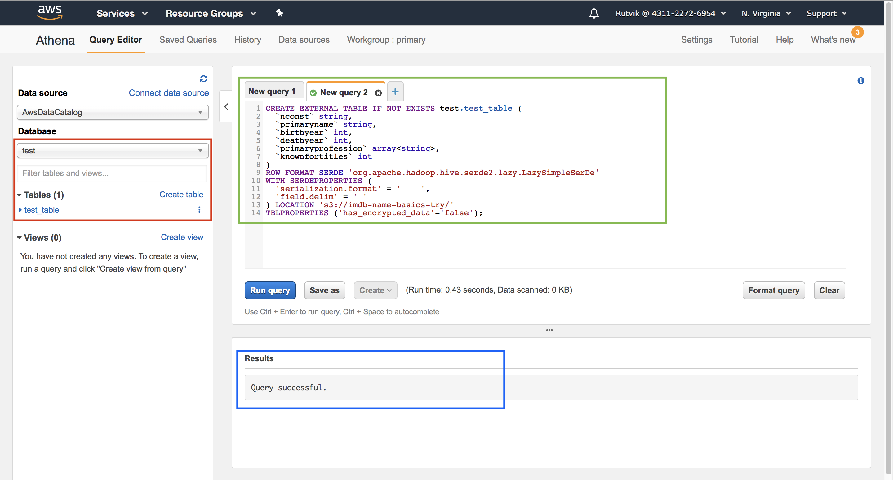

## Internet Movie Database (IMDb) – Data Insights

- [IMDB Dataset](https://datasets.imdbws.com/ "IMDB dataset URL")
- 7 datasets contained in a gzipped, tab-separated-values (TSV) formatted file
- Size of the datasets: 500 MB to 1 GB
- Contains information on movie titles, movie attributes, cast and crew associated with movies, tv episodes, ratings and votes information, actor names and details
- Loading the IMDB datasets:
  - Uploaded the datasets in S3 buckets
  - In Athena, created database and tables, defined the columns, pointed to the files in S3 bucket
  - Defined a Query result location in S3

## IMDB Dataset Description

- Most of the column datatypes are string, integer or float, few of them are arrays
- Important features of dataset: 
  - genres: includes up to three genres associated with the title
  - directors: director(s) of the given title
  - startyear, endyear: used to calculate age of movies, TV Series, etc.
  - runtime minutes: used to calculate min, max runtimes of movies, TV Series, etc.
  - density of movies with respect to average rating and number of votes

## Issue Faced

- Problem while defining datatype for multi-valued columns: 
  - Defined array datatype for multi-valued columns like genres and directors
  - Athena was unable to treat the values as different elements of array
  - Treating all the values as one single element of array

## Solution Provided

- To deal with that, we used `split()` function to convert them into arrays, so the values can be read as different elements:

```sql
CREATE TABLE IF NOT EXISTS title_basics_new AS \
(SELECT tconst, titletype, primarytitle, \
originaltitle, isadult, startyear, endyear, \
runtimeminutes, split(element_at(genres,1),',') \
AS genre FROM title_basics)
```

- Values are now read as different elements of array

## IMDB Queries Implementation

- Implemented 11 interactive queries in Athena to understand:
  - Athena’s ability to handle complex requests
  - Time taken to perform different analysis
- Used inner joins, cross joins, case statements, nested queries, common table expressions, window functions, arrays
- Documentation on running SQL queries using Athena:
  - [Athena User Guide](https://docs.aws.amazon.com/athena/latest/ug/querying-athena-tables.html "Athena User Guide")
  
## IMDB Queries With Some Results - Query 1

- Density of movies within last 5 years against number of votes
  - 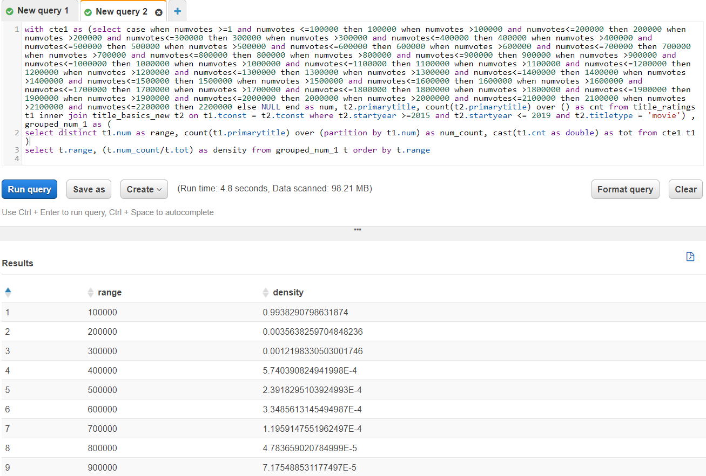

## IMDB Queries With Some Results - Query 2

- A report of minimum & maximum runtime for different types of movies such as ‘Documentary’, ‘Short’, ‘Animation’
  - 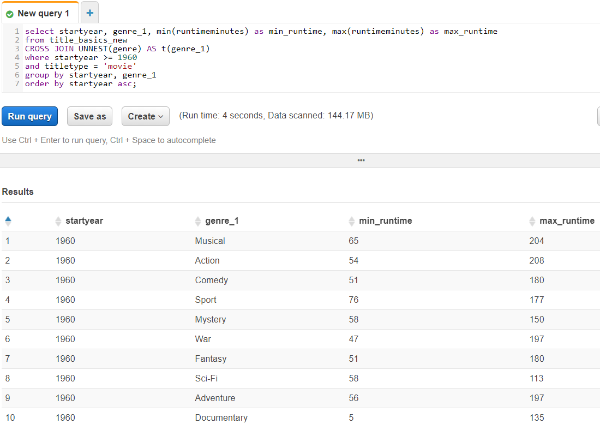

## IMDB Queries With Some Results - Query 3

- Movies with 10 largest sets of co-directors starting from the top largest and going down by size of co-director array, with average rating above 5
  - 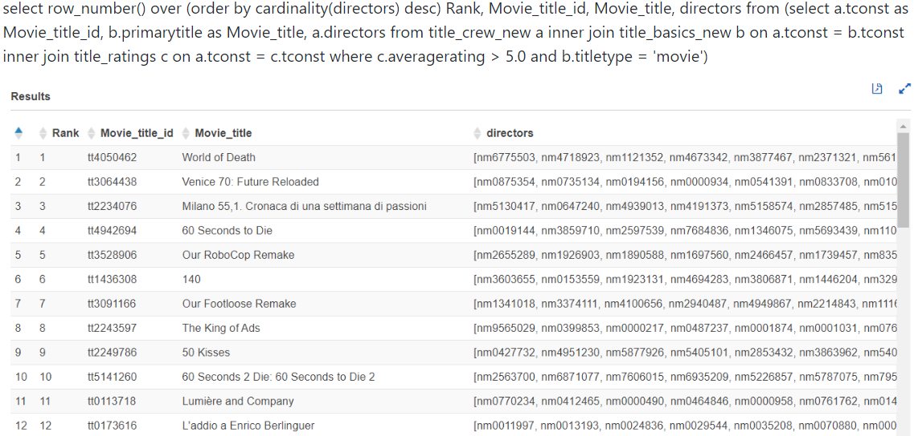

## QuickSight - Somendra and Pablo

- Introduction to Data Visualization


  
## Data Visualization Platforms - Pablo

- New technological advances are used by Data Visualization Platfroms

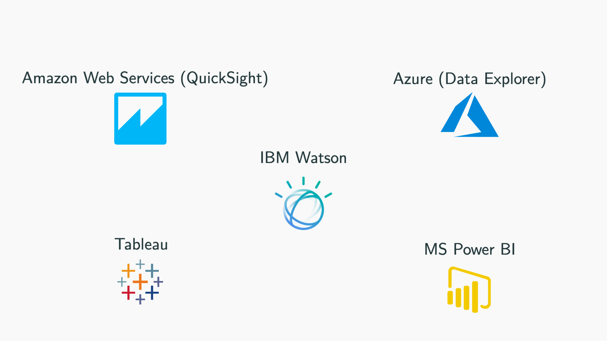
  
## The Importance of Data Visualization based on QuickSight 
 
- Easy interactive Dashboards and Reports
- Not a graph picture, data still accessible

 
 
## Main Features of AWS QuickSight & Competitors - Pablo

- Main features:
  - Cloud-based Platform
  - Pay-Per-Use Model
  - Creates Visualizations / Performs Analysis / Gets Business Insights
  - The AWS Business Intelligence and Analysis tool
  
- AWS QuickSight vs Tableau vs Power BI
  - Three very powerful BI and Analysis tools
  - Some main differences:
    - Pricing model
    - Learning Curve
    - Data Sources and Compatibility

## Data Sources QuickSight Compatibility  - Pablo

- Easy to connect with other Services and Data Sources
- Data Sources supported by AWS QuickSight:

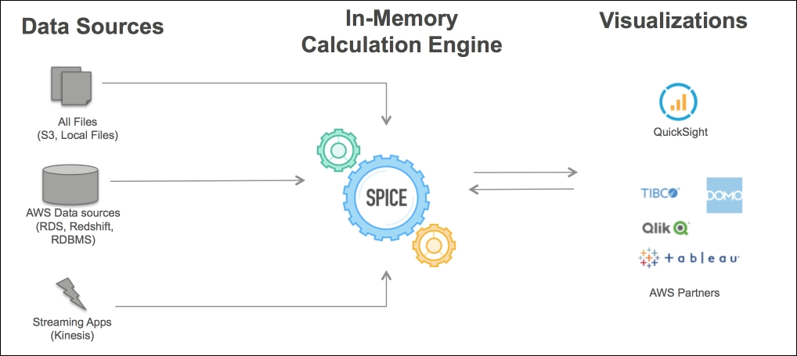
  
## AWS QuickSight SPICE  - Pablo

- SPICE (Super-fast, Parallel, In-memory, Calculation, Engine)
- Performance improve
  - In-memory Processing
  - Not using Direct Query to the Database


## US Accidents dataset

- Downloaded from [Kaggle](https://www.kaggle.com/ "Kaggle"). 
- US Accidents (3.0 million records) [dataset](https://www.kaggle.com/ "dataset").
- Complex + big dataset
- Fields of interest:
  - Level of severity: 1 (least severe) to 4 (most severe).
  - Start time + End time.
  - Distance (in mi): The length of the road extent affected by the accident.
  - Description: Natural language description of the accident.
  - State.
  - Zipcode.
  - Weather condition.
  - Natural and infrastructure parameters.

## Some interesting problems

- Number of accidents in each state for different levels of severity.
- Number of accidents by time range.
- Percentage of level of severity for accidents in good versus bad weather conditions.
- Number of accidents by month year and various parameter range for different levels of severity in good versus bad weather conditions.
- Precious words in description column.
- Average precipitation for 5 select states over time.

*Interesting Tools to query data from Athena into SPICE*

- Aggregate [functions](https://prestodb.io/docs/current/functions/aggregate.html "functions"), Window [functions](https://prestodb.io/docs/current/functions/window.html "functions"), Regexp [functions](https://prestodb.io/docs/current/functions/regexp.html "functions").
- Hierarchical and recursive queries.

**Let's see some visuals created using QuickSight**

## *No. of accidents by severity for different states*


## *Duration of accidents*

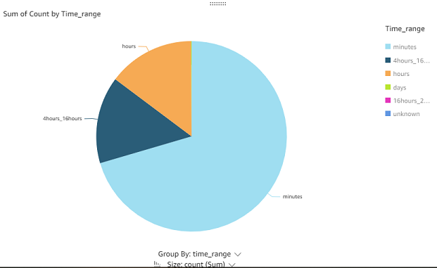

## *Effect of good weather on % of each severity level covering all accidents*


## *Effect of bad weather on % of each severity level covering all accidents*


## *Combined effect of good weather and select parameters on accidents* 
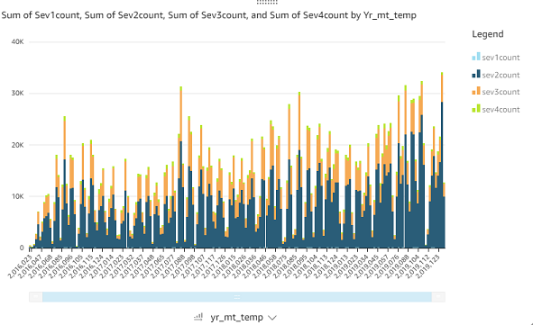

## *Combined effect of weather conditions and select parameters on accidents*
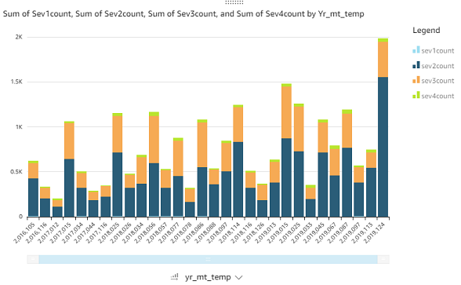

## *Word cloud: finding major theme*


## *Total average preciptation in select states*


## Further investigation:

- How does severity affect the duration of accident?
- How would the graphs of number of accidents for different weather conditions compare if duration of weather conditions was normalized?
- Why are unusual temperatures causing more accidents in bad weather?

## AWS SageMaker Introduction - Balaji

- Its a fully managed machine learning service.
- Easy to build, train and deploy models into a production-ready hosted environment.
- Integrated with SageMaker Studio and Jupyter notebook instance for easy access to your data sources for exploration and analysis
- SageMaker is flexible and provides secure and scalable environment within few clicks from SageMaker Studio.
- Training and hosting are billed by minutes of usage, with no minimum fees and no upfront commitments.

## Features Of Sagemaker - Balaji

- Amazon SageMaker Studio Notebooks and Notebook Instances
  - Can build, train, deploy, and analyze your models all in the same application.
  - Sagemaker studio consists of File Manager, Terminal, Git, Metrics and Graphs sections.
  - Comes with different frameworks like Python, R, PySpark, Mxnet, TensorFlow, Pytorch, Chainer.
- Amazon SageMaker Autopilot
  - It provides automatic machine learning that can quickly build classification and regression models.
  - Users only need to provide a tabular dataset and select the target column to predict.

## Features Of SageMaker Cont1- Balaji

- Amazon SageMaker Ground Truth
  - Ground Truth helps you build high-quality training datasets for your machine learning models.
  - It helps to label the dataset automatically or manually. E.g. Image, Text classification.
- Amazon SageMaker Debugger
  - Enabling the inspection of all the training parameters and data throughout the training process.
  - Use of smdebug Python library that implements the core debugging functionality.

## Features Of SageMaker Cont2- Balaji

- Amazon SageMaker Elastic Inference
  - Speed up the throughput and decrease the latency of getting real-time inferences from your deep learning models.
  - It allows you to add inference acceleration to a hosted endpoint for a fraction of the cost of using a full GPU instance.
- Amazon SageMaker Model Monitor:
  - Amazon SageMaker Model Monitor is a tool for the monitoring and analysis of models in production
  - Model Monitor continuously monitors and analyzes the prediction requests. Model Monitor can store this data and use built-in statistical rules to detect common issues such as outliers in data and data drift.

## Architecture of SageMaker - Balaji

- Docker Container (Elastic Container Registry): Hosting our model for training and testing purpose.
- Model Training: Model trained once by writing code to train.py file
- Deployment Hosting: Testing and Evaluating model by using predictor.py file
- S3 (Simple Storage Service): Storing the model artifacts and dataset.
- Endpoint: Interface for data input and forwarding the data to trained model.
- Models: Trained model attached to the endpoint.

## Architecture of SageMaker Contd - Balaji

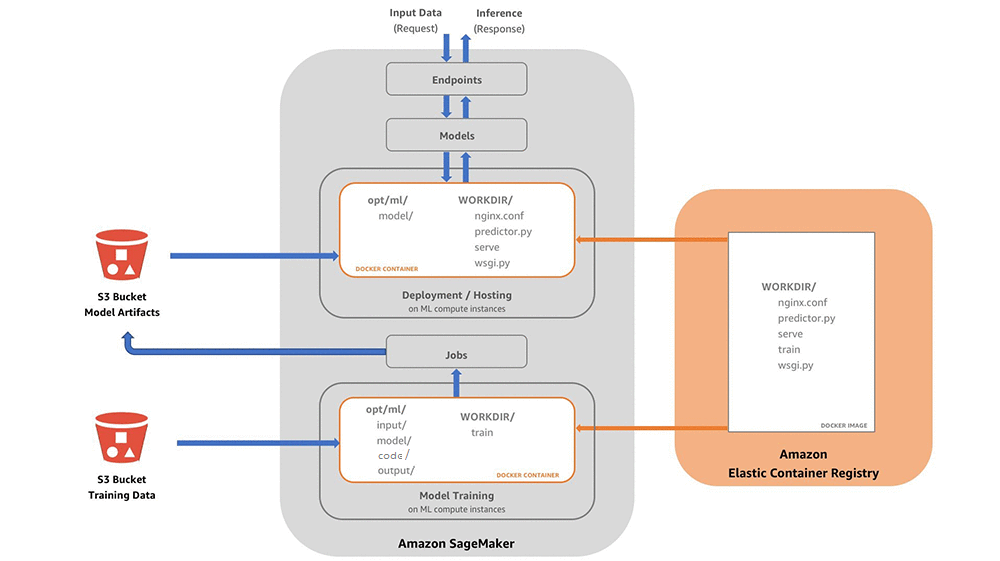

## Why Machine Learning 


## Notebook Instance - Mridul


- We can specify the notebook instance type for optimizing performance as desired

## Dataset - Mridul

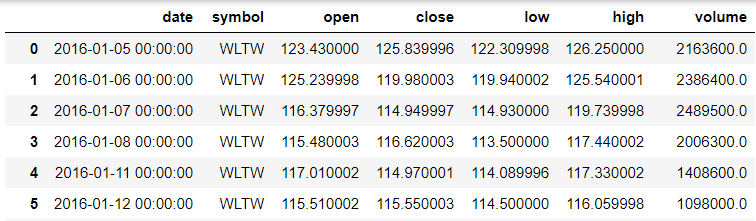

- Dataset Source: NYSE Data set from Kaggle.
- 7 columns. Our interest lies in predicting future stock price
- How we developed the predictors and response variable
  
## Developing the Predictors

- Shift Function: dataframe.shift()
  
  
- X variables include: Today's Stock price, Yesterday's Stock Price, Day before yesterday's Stock Price
- Y variable: 5 days down Stock price

## Final Dataset for Machine Learning


- Feature Explanation
- What are we predicting

## Scatter plot for X variables with respect to Y variable


## Machine Learning Models - Linear Regression


## Machine Learning Models - Extreme Gradient Boosting Regression (XGBR)


## Feature Importance graph with XGBR


## Importance of using SageMaker for Training Model

- This was demo for training a model using Jupyter Notebook.
- The advantage is the Optimized performance and Deployment of model from anywhere
- The main advantange lies in hosting any number of models to amazon SageMaker behind endpoint

## Hosting a model in AWS SageMaker

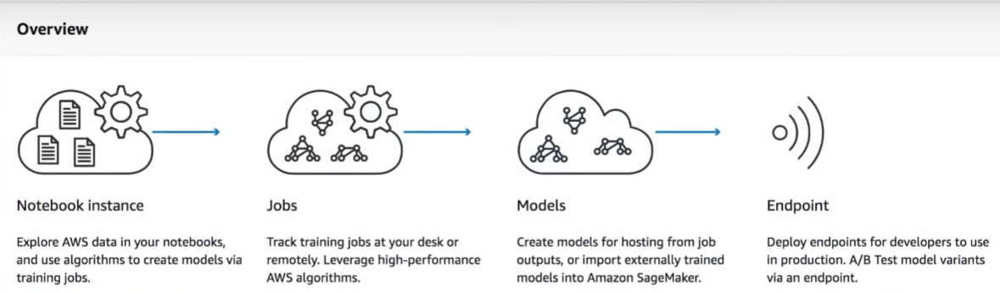

- Model can be trained using notebook instance and stored as a training job.
- This trained job/model can be imported to the container for hosting the model to SageMaker
- Configure the Endpoints that is mentioning instance type, no of models etc.
- Deploy the model behind the endpoint
- All the code for training jobs, hosting, endpoint creation is already present in AWS as Example

## Advantages

- Less time consuming and higher performance.
- Very efficient for performing A/B Testing
- Takes 10 to 20 minutes for hosting multiple models which normally would take hours of coding

## SageMaker inbuilt Examples for hosting Models


## Example Sample

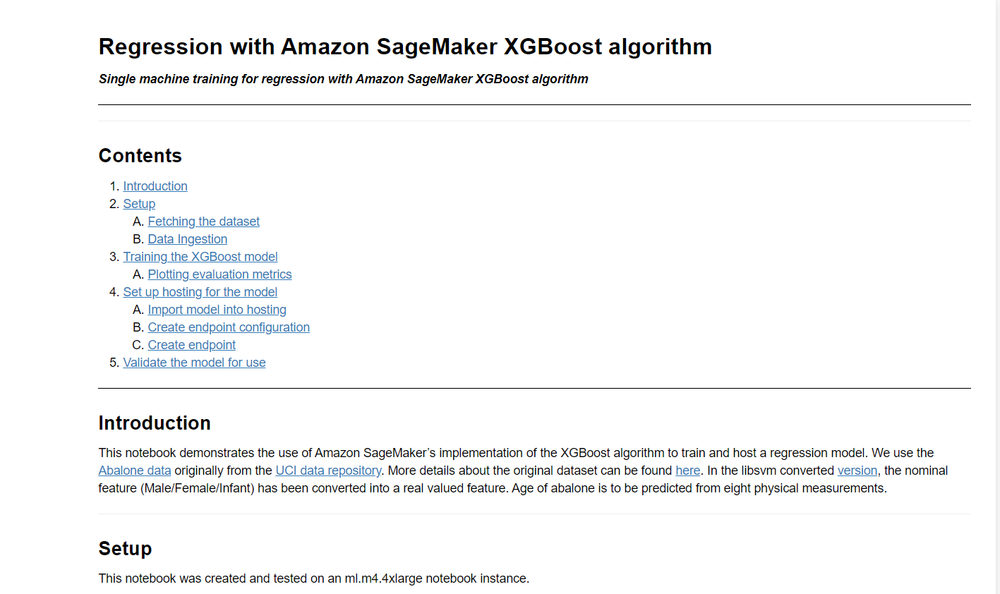

## Code Sample


## Code Sample


## Code Sample


## Dashboard


## Conclusion

- Summary of how the mLogica and IIT teams working together
- Questions?
